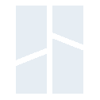

<h1 align="center">Team PHDesign</h1>

<em>Innovation, Combined.</em>

---

### What we're working on

- **[PH60](https://github.com/ph-design/PH60)** — our flagship 60% kit, now on Rev. 3. FDM-printable case, gasket mount, magnetic quick-release top, tri-mode wireless PCB. Build yours with the [PHD Configurator](https://custom.phdesign.cc).

- **[PH60-SC](https://github.com/ph-design/PH60-SC)** — the slim-choc twin. Kailh low-profile switches, 7mm front height, side-mounted USB-C for laptop docking. Also supported by the [PHD Configurator](https://custom.phdesign.cc).

- **[PH-AC](https://github.com/ph-design/PH-AC)** — an arcade-style controller for rhythm games. 7 buttons + dual rotary encoders, switchable keyboard / mouse / gamepad modes with our custom low-latency firmware.

- **[ZMKs](https://github.com/ph-design/zmks)** — our ZMK fork for wireless keyboards, with patches for features upstream doesn't have yet.

### How we work

<strong>Design</strong>

   Blender ·
   Shapr3D ·
   Bambu Studio

<strong>Electronics</strong>

   KiCad ·
   LCEDA

<strong>Firmware</strong>

   QMK ·
   ZMK ·
   Arduino ·
   VS Code

### Special thanks

  
  &nbsp;&nbsp;&nbsp;&nbsp;&nbsp;&nbsp;&nbsp;&nbsp;
  
  &nbsp;&nbsp;&nbsp;&nbsp;&nbsp;&nbsp;&nbsp;&nbsp;
  

- **[Bambu Lab](https://bambulab.com/en)** — sent us a printer and agreed to keep working with us long-term. Most of the case revisions in this repo were prototyped on their hardware. Genuinely, thank you.
- **[JLCPCB](https://jlcpcb.com/)** — free prototype runs while we were dialing things in, plus real help on the industrial 3D printing side — the kind of access three students don't usually get on their own.
- **[Shapr3D](https://www.shapr3d.com/)** — long-term licenses for the whole team. Almost every case in this repo started as a sketch in Shapr3D before it ever touched a slicer.
- **Our users** — the people who actually buy the kits, file issues, and tell us when something feels off. You're the reason this isn't just three people building stuff for themselves.

### Open source

Hardware ships under [CC BY-NC-SA 4.0](https://creativecommons.org/licenses/by-nc-sa/4.0/), firmware under MIT. We'd rather see people fork and remix this than keep anything gated — files, sources, configurator, all open by default.

---

  
  &nbsp;
  
  &nbsp;
  
  &nbsp;
  

  <a href="https://phdesign.cc/">Official website</a> &nbsp;·&nbsp;
  <a href="mailto:dev@phdesign.cc">dev@phdesign.cc</a>

